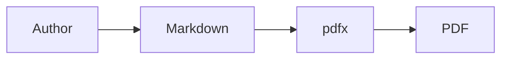

# Deep Dive & Diagrams

This chapter validates sanitized chapter anchors from a filename with spaces and
symbols. It also checks long shell lines and ASCII diagram alignment.

## Long command

```bash
python scripts/build_ebook_from_markdown.py --title "Very Long Technical Handbook Title" --subtitle "A Practical Reference" --page a4 --theme light --accent "#2563eb" --output handbook.pdf chapters/01-intro.md chapters/02-architecture.md chapters/03-operations.md
```

## ASCII diagram

```text
Markdown files
     |
     v
HTML + CSS print rules
     |
     v
WeasyPrint renderer
     |
     v
Publication-quality PDF
```

## Inline SVG (renders natively)

<svg width="440" height="70" viewBox="0 0 440 70" xmlns="http://www.w3.org/2000/svg">
  <!-- a comment that used to break the old md_in_html path -->
  <rect x="6" y="14" width="130" height="42" rx="7" fill="#eff6ff" stroke="#2563eb" stroke-width="2"/>
  <text x="71" y="40" font-size="13" text-anchor="middle" fill="#1e3a8a">Markdown</text>
  <rect x="170" y="14" width="130" height="42" rx="7" fill="#fef9c3" stroke="#ca8a04" stroke-width="2"/>
  <text x="235" y="40" font-size="13" text-anchor="middle" fill="#854d0e">WeasyPrint</text>
  <rect x="320" y="14" width="114" height="42" rx="7" fill="#dcfce7" stroke="#16a34a" stroke-width="2"/>
  <text x="377" y="40" font-size="13" text-anchor="middle" fill="#166534">PDF</text>
</svg>

## Mermaid (auto-rendered to SVG)



## Glossary (feeds --index)

| Term | Meaning |
|---|---|
| **Bookmark** | PDF outline entry for navigation |
| **Leader** | Dotted line between TOC title and page number |
| **Target-counter** | CSS function that prints a referenced page's number |

